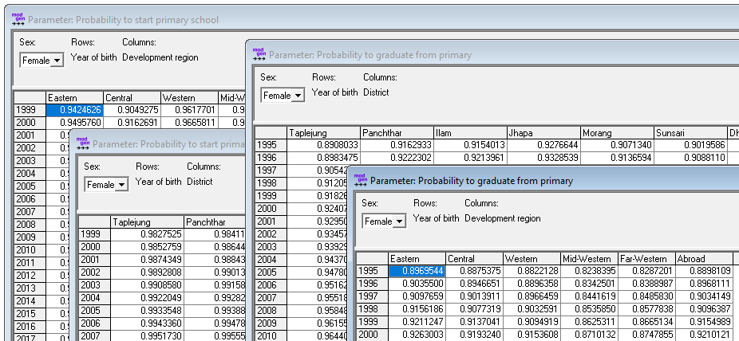
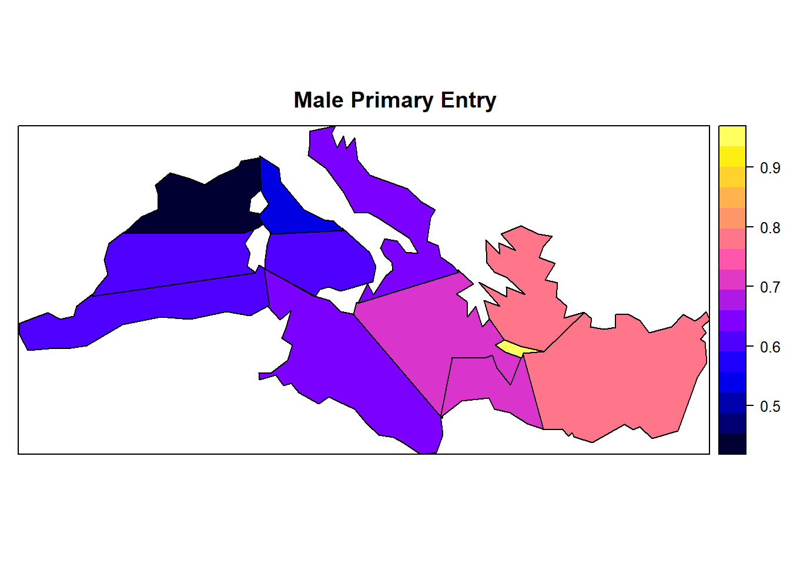
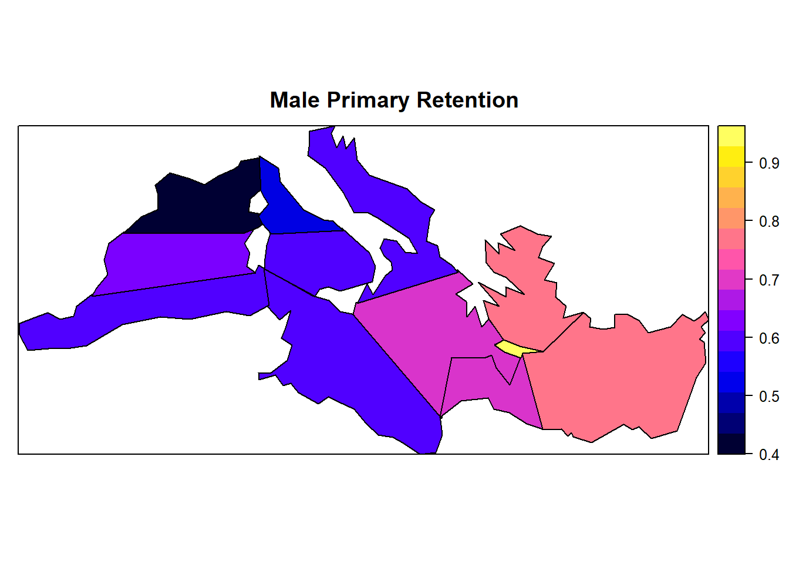

# Script 3: Primary Education

> Primary Education is modeled in two alternative ways. The first follows a cohort approach driven by probabilities to enter and graduate by year of birth, sex, and place of birth. The second approach follows a period approach parameterized by intake-, progression- and repetition- rates by calendar year, sex, grade and location. 


The code below calculates parameters for the cohort model. Place of birth refers alternatively to regions or to districts (2 sets of parameters selected by the model user). For the period model option, data have to be provided from other sources, or can be simulated using the cohort model (which produces period rates as part of its table output). For teh alternative model version, the code below creates corresponding parameter tables containing default values. The code also produces some illustrative maps displaying the current regional differences in school entry and retention by sex.    

### File output

The code below generates model parameters stored in a Modgen .dat file

General parameters:

- Start at school season
-	End of school season
- Regular school entry age 

Parameters of the base cohort model

- Distribution of primary entry age (around regular age) by year of birth
- School entry by region of birth, sex and year of birth
- School entry by district of birth, sex and year of birth
- School retention by region of birth, sex and year of birth
- School retention by district of birth, sex and year of birth
-	Primary reference system flows (start values for calibration to track students through grade system)

Flow Rates of alternative period model:

- Primary Period Intake by region, sex, age, year
- Primary Period Success by region, sex, age, year 
- Primary Period Direct Progression Intake by region, sex, age, year
- Primary Period Delayed Progression Intake by region, sex, age, year
- Primary Period Direct Repetition Intake by region, sex, age, year
- Primary Period Delayed Repetition Intake by region, sex, age, year





## Code

### School Entry

```{r, message=FALSE, warning=FALSE}
####################################################################################################
# 
#  DYNAMIS-POP Parameter Generation File 3 Chunk A - Primary Education School Entry
#  This file is generic and works for all country contexts. 
#  Input file: globals_for_analysis.RData (To generate such a file run the setup script)
#  Last Update: Martin Spielauer 2018-05-12
#
####################################################################################################

####################################################################################################
# Clear work space, load required packages and the input object file
####################################################################################################

rm(list=ls())

library(haven)
library(dplyr)
library(data.table)
library(sp) 
library(maptools)
library(survival)
library(fmsb)
library(eha)

load(file="globals_for_analysis.RData")
parafile        <- file(g_para_primaryeduc, "w") # Output Parameter File
dat             <- g_residents_dat               # Main data object for education analysis

# Constants

n_maxdist       <- max(dat$M_DOB)
n_maxdistP1     <- n_maxdist + 1
n_maxreg        <- max(dat$M_ROB)
n_maxregP1      <- n_maxreg + 1

# Add some variables

dat$m_age       <- as.integer(dat$M_AGE)
dat$m_any_educ  <- as.logical(dat$M_EDUC > 0)
dat$m_finish    <- as.logical(dat$M_EDUC > 1)

####################################################################################################
# Model school Entry by region
####################################################################################################

# remove those out of age range 12-32

dat <- dat[!(dat$m_age < 12),]
dat <- dat[!(dat$m_age > 32),]

# logistic regression school entry male

MaleEntry        <- glm(m_any_educ ~ m_age+factor(M_ROB), family = quasibinomial, weights = M_WEIGHT, data = dat[dat$M_MALE==1,])
MaleEntryPredict <- predict(MaleEntry,data.frame(m_age=rep(11:-51,each=n_maxregP1),M_ROB=rep(0:n_maxreg,63)))
MaleEntryPredict <- exp(MaleEntryPredict) / (1+exp(MaleEntryPredict))

# logistic regression school entry female

FemEntry        <- glm(m_any_educ ~ m_age+factor(M_ROB), family = quasibinomial, weights = M_WEIGHT, data = dat[dat$M_MALE==0,])
FemEntryPredict <- predict(FemEntry,data.frame(m_age=rep(11:-51,each=n_maxregP1),M_ROB=rep(0:n_maxreg,63)))
FemEntryPredict <- exp(FemEntryPredict) / (1+exp(FemEntryPredict))

####################################################################################################
# Write Parameters school Entry by region
####################################################################################################

cat("parameters  {\n\n//EN School entry\ndouble  StartPrimary[SEX][YOB_START_PRIMARY][PROVINCE_INT] = {\n", file=parafile)
cat(format(round(FemEntryPredict,7),scientific=FALSE), file=parafile, sep=", ", append=TRUE)
cat(",\n", file=parafile, append=TRUE)
cat(format(round(MaleEntryPredict,7),scientific=FALSE), file=parafile, sep=", ", append=TRUE)
cat("\n}; \n\n", file=parafile, append=TRUE) 


####################################################################################################
# Model School Entry By Districts
####################################################################################################

# logistic regression school entry male

MaleEntry        <- glm(m_any_educ ~ m_age+factor(M_DOB), family = quasibinomial, weights = M_WEIGHT, data = dat[dat$M_MALE==1,])
MaleEntryPredict <- predict(MaleEntry,data.frame(m_age=rep(11:-51,each=n_maxdistP1),M_DOB=rep(0:n_maxdist,63)))
MaleEntryPredict <- exp(MaleEntryPredict) / (1+exp(MaleEntryPredict))

# logistic regression school entry female

FemEntry        <- glm(m_any_educ ~ m_age+factor(M_DOB), family = quasibinomial, weights = M_WEIGHT, data = dat[dat$M_MALE==0,])
FemEntryPredict <- predict(FemEntry,data.frame(m_age=rep(11:-51,each=n_maxdistP1),M_DOB=rep(0:n_maxdist,63)))
FemEntryPredict <- exp(FemEntryPredict) / (1+exp(FemEntryPredict))

####################################################################################################
# Write Parameters School Entry By Districts
####################################################################################################

cat("\n\n//EN School entry by district\ndouble  StartPrimaryDistrict[SEX][YOB_START_PRIMARY][DISTRICT_INT] = {\n", file=parafile, append=TRUE)
cat(format(round(FemEntryPredict,7),scientific=FALSE), file=parafile, sep=", ", append=TRUE)
cat(",\n", file=parafile, append=TRUE)
cat(format(round(MaleEntryPredict,7),scientific=FALSE), file=parafile, sep=", ", append=TRUE)
cat("\n}; \n\n", file=parafile, append=TRUE) 

####################################################################################################
# Map Illustration current preobabilities (children currently age 12)
####################################################################################################

male_vector   <- head(MaleEntryPredict,length(g_shape_display_order))
female_vector <- head(FemEntryPredict,length(g_shape_display_order))

country_shape <- rgdal::readOGR(g_shapes)

## Districts as coded in Census in the order of districts in the country shape object 
country_shape$censusdist <- g_shape_display_order

## Function taking a SpatialPolygonsDataFrame and adding a vector of values to be displayed on map
## The values come in the order of provinces as coded in the census and are re-ordered to fit the 
## Country shape object

AddVectorForDisplay <- function(country_shape,VectorForDisplay) 
{
  testb          <- data.frame(cbind(new_order=country_shape$censusdist,orig_order=c(0:max(g_shape_display_order))))
  testb          <- testb[order(testb$new_order),]
  testb$newcol   <- VectorForDisplay
  testb          <- testb[order(testb$orig_order),]
  country_shape$graphval <- testb$newcol
  return(country_shape)
}

## The code to plot data 
spplot(AddVectorForDisplay(country_shape,male_vector),c("graphval"), main = "Male Primary Entry" )
spplot(AddVectorForDisplay(country_shape,female_vector),c("graphval"), main = "Female Primary Entry" )
```




### School Retention

```{r, message=FALSE, warning=FALSE}
####################################################################################################
# 
#  DYNAMIS-POP Parameter Generation File 3 Chunk B - Primary Education School Retention
#
####################################################################################################

####################################################################################################
# Model school retention by region
####################################################################################################

# remove those out of age range < 16 and those who never entered

dat <- dat[!(dat$m_age < 16),]
dat <- dat[(dat$m_any_educ == TRUE),]

# logistic regression school entry male

MaleFinish        <- glm(m_finish ~ m_age+factor(M_ROB), family = quasibinomial, weights = M_WEIGHT, data = dat[dat$M_MALE==1,])
MaleFinishPredict <- predict(MaleFinish,data.frame(m_age=rep(15:-51,each=n_maxregP1),M_ROB=rep(0:n_maxreg,67)))
MaleFinishPredict <- exp(MaleFinishPredict) / (1+exp(MaleFinishPredict))

# logistic regression school entry female

FemFinish        <- glm(m_finish ~ m_age+factor(M_ROB), family = quasibinomial, weights = M_WEIGHT, data = dat[dat$M_MALE==0,])
FemFinishPredict <- predict(FemFinish,data.frame(m_age = rep(15:-51,each=n_maxregP1),M_ROB=rep(0:n_maxreg,67)))
FemFinishPredict <- exp(FemFinishPredict) / (1+exp(FemFinishPredict))

####################################################################################################
# Write parameters for school retention by region
####################################################################################################

cat("\n\n//EN School retention\ndouble  GradPrimary[SEX][YOB_GRAD_PRIMARY][PROVINCE_INT] = {\n", file=parafile, append=TRUE)
cat(format(round(FemFinishPredict,7),scientific=FALSE), file=parafile, sep=", ", append=TRUE)
cat(",\n", file=parafile, append=TRUE)
cat(format(round(MaleFinishPredict,7),scientific=FALSE), file=parafile, sep=", ", append=TRUE)
cat("\n}; \n\n", file=parafile, append=TRUE) 

####################################################################################################
# Model School Retention By Districts
####################################################################################################

MaleFinish        <- glm(m_finish ~ m_age+factor(M_DOB), family = quasibinomial, weights = M_WEIGHT, data = dat[dat$M_MALE==1,])
MaleFinishPredict <- predict(MaleFinish,data.frame(m_age=rep(15:-51,each=n_maxdistP1),M_DOB=rep(0:n_maxdist,67)))
MaleFinishPredict <- exp(MaleFinishPredict) / (1+exp(MaleFinishPredict))

# logistic regression school entry female

FemFinish        <- glm(m_finish ~ m_age+factor(M_DOB), family = quasibinomial, weights = M_WEIGHT, data = dat[dat$M_MALE==0,])
FemFinishPredict <- predict(FemFinish,data.frame(m_age = rep(15:-51,each=n_maxdistP1),M_DOB=rep(0:n_maxdist,67)))
FemFinishPredict <- exp(FemFinishPredict) / (1+exp(FemFinishPredict))

####################################################################################################
# Write parameters for School Retention By Districts
####################################################################################################

cat("\n\n//EN School retention\ndouble  GradPrimaryDistrict[SEX][YOB_GRAD_PRIMARY][DISTRICT_INT] = {\n", file=parafile, append=TRUE)
cat(format(round(FemFinishPredict,7),scientific=FALSE), file=parafile, sep=", ", append=TRUE)
cat(",\n", file=parafile, append=TRUE)
cat(format(round(MaleFinishPredict,7),scientific=FALSE), file=parafile, sep=", ", append=TRUE)
cat("\n  }; ", file=parafile, append=TRUE) 

####################################################################################################
# Map Illustration current retention (children currently age 12)
####################################################################################################

male_vector   <- head(MaleFinishPredict,length(g_shape_display_order))
female_vector <- head(FemFinishPredict,length(g_shape_display_order))

country_shape <- rgdal::readOGR(g_shapes)

## Census districts as coded in Census in the order of districts in the Nepal shape object (ID_3)
country_shape$censusdist <- g_shape_display_order

## The code to plot data 
spplot(AddVectorForDisplay(country_shape,male_vector),c("graphval"), main = "Male Primary Retention" )
spplot(AddVectorForDisplay(country_shape,female_vector),c("graphval"), main = "Female Primary Retention")
```




### General Settings And Parameters of The Alternative Model Version (Default Values)

Parameters for the alternative model version are default progression rates and have to be replaced by model users by actual data and scenarios when using this model option. These parameters are included in the output as their size depends on country specifica like the number of province and they are required to run a model also when the base scenario is chosen. 


```{r, message=FALSE, warning=FALSE}
####################################################################################################
# 
#  DYNAMIS-POP Parameter Generation File 3 Chunk C - Primary Education Settings and Alternative Model
#
####################################################################################################

cat("\n", file=parafile, append=TRUE)
cat("   double	SchoolSeasonStart = ",g_school_season+0.0001,"; //EN Start at school season\n", file=parafile, append=TRUE)
cat("   double	SchoolSeasonEnd = ",g_school_season,"; //EN End of school season\n", file=parafile, append=TRUE)
cat("   cumrate PrimEntryAge[YOB_START_PRIMARY][PRIM_SYST_ENTRY_AGES] = {(63){0.05, 0.80, (3) 0.05,},}; //EN Distribution of primary entry age\n", file=parafile, append=TRUE)
cat("   double	PrimaryReferenceSystem[PRIM_FLOW][PRIM_GRADES] = {(5) {	(6) 0.9, },	}; //EN Primary reference system flows\n", file=parafile, append=TRUE)
cat("   int	AgeEnterPrimary = ",g_school_entry,"; //EN School entry age primary\n", file=parafile, append=TRUE)	

cat("   //EN Primary Period Intake\n", file=parafile, append=TRUE)	
cat("   double	PrimaryPeriodIntake[PROVINCE_NAT][SEX][PRIM_SYST_ENTRY_AGES][SIM_YEAR_RANGE] = {(",n_maxreg,") {(2) {(101) 0.05, (101) 0.80, (303) 0.05,},},};\n", file=parafile, append=TRUE)	
cat("   //EN Primary Period Success\n", file=parafile, append=TRUE)	
cat("   double	PrimaryPeriodSuccess[PROVINCE_NAT][SEX][PRIM_GRADES][SIM_YEAR_RANGE] = {(",n_maxreg,") {(1212) 0.95,},};\n", file=parafile, append=TRUE)	

cat("   //EN Primary Period Direct Progression Intake\n", file=parafile, append=TRUE)	
cat("   double	PrimaryPeriodDirectProgressionIntake[PROVINCE_NAT][SEX][PRIM_GRADES2P][SIM_YEAR_RANGE] = {(",n_maxreg,") {(1010) 0.95,},};\n", file=parafile, append=TRUE)	

cat("   //EN Primary Period Delayed Progression Intake\n", file=parafile, append=TRUE)	
cat("   double	PrimaryPeriodDelayedProgressionIntake[PROVINCE_NAT][SEX][PRIM_GRADES2P][SIM_YEAR_RANGE] = {(",n_maxreg,") {(1010) 0.95,},};\n", file=parafile, append=TRUE)	

cat("   //EN Primary Period Direct Repetition Intake\n", file=parafile, append=TRUE)	
cat("   double	PrimaryPeriodDirectRepetitionIntake[PROVINCE_NAT][SEX][PRIM_GRADES][SIM_YEAR_RANGE] = {(",n_maxreg,") {(1212) 0.95,},};\n", file=parafile, append=TRUE)	

cat("   //EN Primary Period Delayed Repetition Intake\n", file=parafile, append=TRUE)	
cat("   double PrimaryPeriodDelayedRepetitionIntake[PROVINCE_NAT][SEX][PRIM_GRADES][SIM_YEAR_RANGE] = {(",n_maxreg,") {(1212) 0.95,},};\n", file=parafile, append=TRUE)	

# end and close parameter output writing
cat("\n\n};", file=parafile, append=TRUE) 
close(parafile)
```