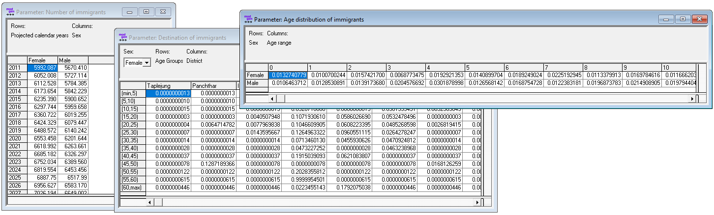

# Script 5: Immigration


>  Immigration is modeled by total number by sex and year, age distribution by sex, and destination district by age and sex. Distributional pattern are assumed to be time-invariant, the total number is assumed to increase at a fixed rate.


## File output

The code below generates 3 model parameters stored in a Modgen .dat file

- Number of immigrants by year and sex
- Age distribution of immigrants by sex
- Destination district of immigrants by age and sex



## Code


```{r, message=FALSE, warning=FALSE}
####################################################################################################
# 
#  DYNAMIS-POP Parameter Generation File 5 - Immigration
#  This file is generic and works for all country contexts. 
#  Input file: globals_for_analysis.RData (To generate such a file run the setup script)
#  Last Update: Martin Spielauer 2018-05-12
#
####################################################################################################

####################################################################################################
# Clear work space, load required packages and the input object file
####################################################################################################

rm(list=ls())

library(haven)
library(dplyr)
library(data.table)
library(sp) 
library(maptools)
library(survival)
library(fmsb)
library(eha)

load(file="globals_for_analysis.RData")
dat <-  g_residents_dat

# Set Parameter Output File
parafile <- file(g_para_immigration, "w")

# Remove those in the country 12 months ago 
n_abroad <- max(dat$M_DOB)
dat <- dat[dat$M_PDIST==n_abroad,]

# Add an integer variable for age a year ago
dat$m_ageago <- as.integer(dat$M_AGE-0.5)
dat[dat$m_ageago<0,] <- 0

####################################################################################################
# Create and append a dataset of all possible immigrations for each age 
# This is to avoid empty cells in matrices
# The records have very low weights which do not affect overall immigration
####################################################################################################

umale <- unique(dat$M_MALE)
udist <- 0:(n_abroad-1)
uage  <- 0:100

# Keep only what's needed
dat <- dat[,c("M_WEIGHT", "M_MALE", "M_DOR", "m_ageago" )]

allmigs <- expand.grid(M_MALE=umale, M_DOR=udist, m_ageago=uage)
allmigs$M_WEIGHT <- 0.0000001
dat <- rbind(dat, allmigs)

# Age groups 5 years ago, up to 60+ 

dat$m_agegr5 <- as.integer(dat$m_ageago/5) * 5
dat$m_agegr5[dat$m_agegr5>60] <- 60

####################################################################################################
# Calculate the parameter NumberImmigrants[SIM_YEAR_RANGE][SEX]
# Immigrants last year and a growth rate scenario with growth "yearlygrowth" to be specified here
####################################################################################################

yearlygrowth <- g_immigration_number_growth

# Create the parameter for total immigration past year
immigrants <- as.data.frame(xtabs(dat$M_WEIGHT ~ dat$M_MALE))
immigrants <- immigrants[order(immigrants$dat.M_MALE),] 

####################################################################################################
# Write the parameter MigrationProbability[SEX][AGE5_PART][DISTRICT_NAT] 
####################################################################################################

cat("parameters { \n  //EN Number of immigrants\ndouble	NumberImmigrants[SIM_YEAR_RANGE][SEX] = {\n", file=parafile)

for (pos in c(1:101))
{
  cat(format(round(immigrants$Freq * yearlygrowth^pos,5),scientific=FALSE),"\n", file=parafile, sep=", ", append=TRUE)
}
cat("\n}; \n\n", file=parafile, append=TRUE) 

####################################################################################################
# Calculate the parameter cumrate	AgeImmigrants[SEX][AGE_RANGE]            
####################################################################################################

immibyage           <- as.data.frame(xtabs(dat$M_WEIGHT ~ dat$M_MALE + dat$m_ageago))
immibyage$groupsum  <- ave(immibyage$Freq, immibyage$dat.M_MALE, FUN=sum)
immibyage$paravalue <- immibyage$Freq / immibyage$groupsum
immibyage           <- immibyage[order(immibyage$dat.M_MALE, immibyage$dat.m_ageago),]

####################################################################################################
# Write the parameter AgeImmigrants[SEX][AGE_RANGE] 
####################################################################################################

cat("\n\n//EN Age distribution of immigrants\ncumrate AgeImmigrants[SEX][AGE_RANGE] = {\n", file=parafile, append=TRUE)
cat(format(round(immibyage$paravalue,10),scientific=FALSE), file=parafile, sep=", ", append=TRUE)
cat("\n}; \n\n", file=parafile, append=TRUE) 

####################################################################################################
# Calculate the parameter DestinationImmigrants[SEX][AGE5_PART][DISTRICT_NAT]            
####################################################################################################

immidest            <- as.data.frame(xtabs(dat$M_WEIGHT ~ dat$M_MALE + dat$m_agegr5 + dat$M_DOR))
immidest$groupsum   <- ave(immidest$Freq, immidest$dat.M_MALE, immidest$dat.m_agegr5, FUN=sum)
immidest$paravalue  <- immidest$Freq / immidest$groupsum
immidest            <- immidest[order(immidest$dat.M_MALE, immidest$dat.m_agegr5, immidest$dat.M_DOR),]

####################################################################################################
# Write the parameter DestinationImmigrants[SEX][AGE5_PART][DISTRICT_NAT]            
####################################################################################################

cat("\n\n//EN Destination of immigrants\ncumrate DestinationImmigrants[SEX][AGE5_PART][DISTRICT_NAT] = {\n", file=parafile, append=TRUE)
cat(format(round(immidest$paravalue,10),scientific=FALSE), file=parafile, sep=", ", append=TRUE)
cat("\n  }; \n};\n", file=parafile, append=TRUE) 
close(parafile)

```
