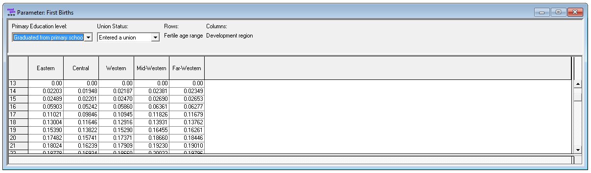

# Script 8: First Births

>  First births are modeled from the census depending on education, age, region of residence and marriage using logistic regression. Models are estimated separately by education and assume proportionality between regions. 


## File output

The code below generates model parameters stored in a Modgen .dat file

- First birth rates by education, union status, age and region
- A birth trend parameter by parity and year with default values (no trend)




## Code


```{r, message=FALSE, warning=FALSE}
####################################################################################################
# 
#  DYNAMIS-POP Parameter Generation File 8 - First Births
#  This file is generic and works for all country contexts. 
#  Input file: globals_for_analysis.RData (To generate such a file run the setup script)
#  Last Update: Martin Spielauer 2018-05-12
#
####################################################################################################

####################################################################################################
# Clear work space, load required packages and the input object file
####################################################################################################

rm(list=ls())

library(haven)
library(dplyr)
library(data.table)
library(sp) 
library(maptools)
library(survival)
library(fmsb)
library(eha)


load(file="globals_for_analysis.RData")


####################################################################################################
# alldat: ever-married females 10.5 -50.5 who were childless 1 year ago
####################################################################################################

alldat <- g_residents_dat

# Set Parameter Output File

parafile <- file(g_para_firstbirths, "w")

# select observations 
alldat <- alldat[alldat$M_MALE == 0 & alldat$M_AGE >= 10.5 & alldat$M_AGE < 50.5,]
alldat <- alldat[alldat$M_PARITY == alldat$M_BIR12,] 

# variables
alldat$age     <- as.integer(alldat$M_AGE-0.5)
alldat$birth   <- as.logical(alldat$M_BIR12 > 0)

####################################################################################################
# Regressions
####################################################################################################

n_regions <- length(unique(alldat$M_ROR))

# logistic regression age 10-14 married

BirthYoungMar <- glm(birth ~ factor(age)+factor(M_EDUC)+factor(M_ROR), family = quasibinomial, 
                             weights = M_WEIGHT, data = alldat[ !is.na(alldat$M_AGEMAR) & alldat$age < 15 ,])

# Educ 0

if (count(alldat[ !is.na(alldat$M_AGEMAR) & alldat$age == 10 & alldat$M_EDUC==0,]) > 0) { 
  BirthYoungMarPredict0 <- predict(BirthYoungMar,data.frame(age=rep(10,each=n_regions),M_ROR=rep(0:(n_regions-1),1), M_EDUC=0)) 
  BirthYoungMarPredict0 <- exp(BirthYoungMarPredict0) / (1+exp(BirthYoungMarPredict0)) 
} else BirthYoungMarPredict0 <-rep(0,n_regions)

if (count(alldat[ !is.na(alldat$M_AGEMAR) & alldat$age == 11 & alldat$M_EDUC==0,]) > 0) {
  a_add <- predict(BirthYoungMar,data.frame(age=rep(11,each=n_regions),M_ROR=rep(0:(n_regions-1),1), M_EDUC=0))
  a_add <- exp(a_add) / (1+exp(a_add)) 
} else a_add <- rep(0,n_regions)
BirthYoungMarPredict0 <- c(BirthYoungMarPredict0, a_add)

if (count(alldat[ !is.na(alldat$M_AGEMAR) & alldat$age == 12 & alldat$M_EDUC==0,]) > 0) {
  a_add <- predict(BirthYoungMar,data.frame(age=rep(12,each=n_regions),M_ROR=rep(0:(n_regions-1),1), M_EDUC=0))
  a_add <- exp(a_add) / (1+exp(a_add)) 
} else a_add <- rep(0,n_regions)
BirthYoungMarPredict0 <- c(BirthYoungMarPredict0, a_add)

if (count(alldat[ !is.na(alldat$M_AGEMAR) & alldat$age == 13 & alldat$M_EDUC==0,]) > 0) {
  a_add <- predict(BirthYoungMar,data.frame(age=rep(13,each=n_regions),M_ROR=rep(0:(n_regions-1),1), M_EDUC=0))
  a_add <- exp(a_add) / (1+exp(a_add)) 
} else a_add <- rep(0,n_regions)
BirthYoungMarPredict0 <- c(BirthYoungMarPredict0, a_add)

if (count(alldat[ !is.na(alldat$M_AGEMAR) & alldat$age == 14 & alldat$M_EDUC==0,]) > 0) {
  a_add <- predict(BirthYoungMar,data.frame(age=rep(14,each=n_regions),M_ROR=rep(0:(n_regions-1),1), M_EDUC=0))
  a_add <- exp(a_add) / (1+exp(a_add)) 
} else a_add <- rep(0,n_regions)
BirthYoungMarPredict0 <- c(BirthYoungMarPredict0, a_add)

# Educ 1

if (count(alldat[ !is.na(alldat$M_AGEMAR) & alldat$age == 10 & alldat$M_EDUC==1,]) > 0) { 
  BirthYoungMarPredict1 <- predict(BirthYoungMar,data.frame(age=rep(10,each=n_regions),M_ROR=rep(0:(n_regions-1),1), M_EDUC=1)) 
  BirthYoungMarPredict1 <- exp(BirthYoungMarPredict1) / (1+exp(BirthYoungMarPredict1)) 
} else BirthYoungMarPredict1 <-rep(0,n_regions)

if (count(alldat[ !is.na(alldat$M_AGEMAR) & alldat$age == 11 & alldat$M_EDUC==1,]) > 0) {
  a_add <- predict(BirthYoungMar,data.frame(age=rep(11,each=n_regions),M_ROR=rep(0:(n_regions-1),1), M_EDUC=1))
  a_add <- exp(a_add) / (1+exp(a_add)) 
} else a_add <- rep(0,n_regions)
BirthYoungMarPredict1 <- c(BirthYoungMarPredict1, a_add)

if (count(alldat[ !is.na(alldat$M_AGEMAR) & alldat$age == 12 & alldat$M_EDUC==1,]) > 0) {
  a_add <- predict(BirthYoungMar,data.frame(age=rep(12,each=n_regions),M_ROR=rep(0:(n_regions-1),1), M_EDUC=1))
  a_add <- exp(a_add) / (1+exp(a_add)) 
} else a_add <- rep(0,n_regions)
BirthYoungMarPredict1 <- c(BirthYoungMarPredict1, a_add)

if (count(alldat[ !is.na(alldat$M_AGEMAR) & alldat$age == 13 & alldat$M_EDUC==1,]) > 0) {
  a_add <- predict(BirthYoungMar,data.frame(age=rep(13,each=n_regions),M_ROR=rep(0:(n_regions-1),1), M_EDUC=1))
  a_add <- exp(a_add) / (1+exp(a_add)) 
} else a_add <- rep(0,n_regions)
BirthYoungMarPredict1 <- c(BirthYoungMarPredict1, a_add)

if (count(alldat[ !is.na(alldat$M_AGEMAR) & alldat$age == 14 & alldat$M_EDUC==1,]) > 0) {
  a_add <- predict(BirthYoungMar,data.frame(age=rep(14,each=n_regions),M_ROR=rep(0:(n_regions-1),1), M_EDUC=1))
  a_add <- exp(a_add) / (1+exp(a_add)) 
} else a_add <- rep(0,n_regions)
BirthYoungMarPredict1 <- c(BirthYoungMarPredict1, a_add)

# Educ 2

if (count(alldat[ !is.na(alldat$M_AGEMAR) & alldat$age == 10 & alldat$M_EDUC==2,]) > 0) { 
  BirthYoungMarPredict2 <- predict(BirthYoungMar,data.frame(age=rep(10,each=n_regions),M_ROR=rep(0:(n_regions-1),1), M_EDUC=2)) 
  BirthYoungMarPredict2 <- exp(BirthYoungMarPredict2) / (1+exp(BirthYoungMarPredict2)) 
} else BirthYoungMarPredict2 <-rep(0,n_regions)

if (count(alldat[ !is.na(alldat$M_AGEMAR) & alldat$age == 11 & alldat$M_EDUC==2,]) > 0) {
  a_add <- predict(BirthYoungMar,data.frame(age=rep(11,each=n_regions),M_ROR=rep(0:(n_regions-1),1), M_EDUC=2))
  a_add <- exp(a_add) / (1+exp(a_add)) 
} else a_add <- rep(0,n_regions)
BirthYoungMarPredict2 <- c(BirthYoungMarPredict2, a_add)

if (count(alldat[ !is.na(alldat$M_AGEMAR) & alldat$age == 12 & alldat$M_EDUC==2,]) > 0) {
  a_add <- predict(BirthYoungMar,data.frame(age=rep(12,each=n_regions),M_ROR=rep(0:(n_regions-1),1), M_EDUC=2))
  a_add <- exp(a_add) / (1+exp(a_add)) 
} else a_add <- rep(0,n_regions)
BirthYoungMarPredict2 <- c(BirthYoungMarPredict2, a_add)

if (count(alldat[ !is.na(alldat$M_AGEMAR) & alldat$age == 13 & alldat$M_EDUC==2,]) > 0) {
  a_add <- predict(BirthYoungMar,data.frame(age=rep(13,each=n_regions),M_ROR=rep(0:(n_regions-1),1), M_EDUC=2))
  a_add <- exp(a_add) / (1+exp(a_add)) 
} else a_add <- rep(0,n_regions)
BirthYoungMarPredict2 <- c(BirthYoungMarPredict2, a_add)

if (count(alldat[ !is.na(alldat$M_AGEMAR) & alldat$age == 14 & alldat$M_EDUC==2,]) > 0) {
  a_add <- predict(BirthYoungMar,data.frame(age=rep(14,each=n_regions),M_ROR=rep(0:(n_regions-1),1), M_EDUC=2))
  a_add <- exp(a_add) / (1+exp(a_add)) 
} else a_add <- rep(0,n_regions)
BirthYoungMarPredict2 <- c(BirthYoungMarPredict2, a_add)


# logistic regression age 10-14 unmarried

BirthYoungSing         <- glm(birth ~ factor(age)+factor(M_EDUC), family = quasibinomial, weights = M_WEIGHT, 
                          data = alldat[is.na(alldat$M_AGEMAR) & alldat$age < 15,])

BirthYoungSingPredict0 <- predict(BirthYoungSing,data.frame(age=rep(10:14,each=n_regions),M_EDUC=0))
BirthYoungSingPredict0 <- exp(BirthYoungSingPredict0) / (1+exp(BirthYoungSingPredict0))

BirthYoungSingPredict1 <- predict(BirthYoungSing,data.frame(age=rep(10:14,each=n_regions),M_EDUC=1))
BirthYoungSingPredict1 <- exp(BirthYoungSingPredict1) / (1+exp(BirthYoungSingPredict1))

BirthYoungSingPredict2 <- predict(BirthYoungSing,data.frame(age=rep(10:14,each=n_regions),M_EDUC=2))
BirthYoungSingPredict2 <- exp(BirthYoungSingPredict2) / (1+exp(BirthYoungSingPredict2))

# logistic regression age 15-49 unmarried

BirthSing             <- glm(birth ~ factor(age)+factor(M_EDUC)+factor(M_ROR), family = quasibinomial, weights = M_WEIGHT, 
                         data = alldat[ is.na(alldat$M_AGEMAR) & alldat$age >= 15 ,])
BirthSingPredict0     <- predict(BirthSing,data.frame(age=rep(15:49,each=n_regions),M_ROR=rep(0:(n_regions-1),35), M_EDUC=0))
BirthSingPredict0     <- exp(BirthSingPredict0) / (1+exp(BirthSingPredict0))

BirthSingPredict1     <- predict(BirthSing,data.frame(age=rep(15:49,each=n_regions),M_ROR=rep(0:(n_regions-1),35), M_EDUC=1))
BirthSingPredict1     <- exp(BirthSingPredict1) / (1+exp(BirthSingPredict1))

BirthSingPredict2     <- predict(BirthSing,data.frame(age=rep(15:49,each=n_regions),M_ROR=rep(0:(n_regions-1),35), M_EDUC=2))
BirthSingPredict2     <- exp(BirthSingPredict2) / (1+exp(BirthSingPredict2))

# Married age >= 15
# logistic regression education level 0

BirthEduc0            <- glm(birth ~ factor(age)+factor(M_ROR), family = quasibinomial, weights = M_WEIGHT, data =
                         alldat[alldat$M_EDUC==0 & !is.na(alldat$M_AGEMAR) & alldat$age >=15,])
BirthEduc0Predict     <- predict(BirthEduc0,data.frame(age=rep(15:49,each=n_regions),M_ROR=rep(0:(n_regions-1),35)))
BirthEduc0Predict     <- exp(BirthEduc0Predict) / (1+exp(BirthEduc0Predict))

# logistic regression education level 1

BirthEduc1            <- glm(birth ~ factor(age)+factor(M_ROR), family = quasibinomial, weights = M_WEIGHT, 
                         data = alldat[alldat$M_EDUC==1 & !is.na(alldat$M_AGEMAR) & alldat$age >=15,])
BirthEduc1Predict     <- predict(BirthEduc1,data.frame(age=rep(15:49,each=n_regions),M_ROR=rep(0:(n_regions-1),35)))
BirthEduc1Predict     <- exp(BirthEduc1Predict) / (1+exp(BirthEduc1Predict))

# logistic regression education level 3

BirthEduc2            <- glm(birth ~ factor(age)+factor(M_ROR), family = quasibinomial, weights = M_WEIGHT, 
                         data = alldat[alldat$M_EDUC==2 & !is.na(alldat$M_AGEMAR) & alldat$age >=15,])

BirthEduc2Predict     <- predict(BirthEduc2,data.frame(age=rep(15:49,each=n_regions),M_ROR=rep(0:(n_regions-1),35)))
BirthEduc2Predict     <- exp(BirthEduc2Predict) / (1+exp(BirthEduc2Predict))

####################################################################################################
# Write the parameter FirstBirthRates[PRIMARY_LEVEL][UNION_STATUS][FERTILE_AGE_RANGE][PROVINCE_NAT]
####################################################################################################

cat("parameters {\n  //EN First Birth Rates\ndouble  FirstBirthRates[PRIMARY_LEVEL][UNION_STATUS][FERTILE_AGE_RANGE][PROVINCE_NAT] = {\n", file=parafile)

cat(format(round(BirthYoungSingPredict0,5),scientific=FALSE), file=parafile, sep=", ", append=TRUE)
cat(",\n", file=parafile, append=TRUE)
cat(format(round(BirthSingPredict0,5),scientific=FALSE), file=parafile, sep=", ", append=TRUE)
cat(",\n", file=parafile, append=TRUE)
cat(format(round(BirthYoungMarPredict0,5),scientific=FALSE), file=parafile, sep=", ", append=TRUE)
cat(",\n", file=parafile, append=TRUE)
cat(format(round(BirthEduc0Predict,5),scientific=FALSE), file=parafile, sep=", ", append=TRUE)
cat(",\n", file=parafile, append=TRUE)

cat(format(round(BirthYoungSingPredict1,5),scientific=FALSE), file=parafile, sep=", ", append=TRUE)
cat(",\n", file=parafile, append=TRUE)
cat(format(round(BirthSingPredict1,5),scientific=FALSE), file=parafile, sep=", ", append=TRUE)
cat(",\n", file=parafile, append=TRUE)
cat(format(round(BirthYoungMarPredict1,5),scientific=FALSE), file=parafile, sep=", ", append=TRUE)
cat(",\n", file=parafile, append=TRUE)
cat(format(round(BirthEduc1Predict,5),scientific=FALSE), file=parafile, sep=", ", append=TRUE)
cat(",\n", file=parafile, append=TRUE)

cat(format(round(BirthYoungSingPredict2,5),scientific=FALSE), file=parafile, sep=", ", append=TRUE)
cat(",\n", file=parafile, append=TRUE)
cat(format(round(BirthSingPredict2,5),scientific=FALSE), file=parafile, sep=", ", append=TRUE)
cat(",\n", file=parafile, append=TRUE)
cat(format(round(BirthYoungMarPredict2,5),scientific=FALSE), file=parafile, sep=", ", append=TRUE)
cat(",\n", file=parafile, append=TRUE)
cat(format(round(BirthEduc2Predict,5),scientific=FALSE), file=parafile, sep=", ", append=TRUE)
cat("\n};", file=parafile, append=TRUE)

####################################################################################################
# Write parameter for birth trends
####################################################################################################

cat("//EN Birth Trends\n", file=parafile, append=TRUE)
cat("double	BirthTrends[PARITY_RANGE1][SIM_YEAR_RANGE] = {(1515) 1.0 };\n", file=parafile, append=TRUE)

cat("\n};", file=parafile, append=TRUE)
close(parafile)

```


